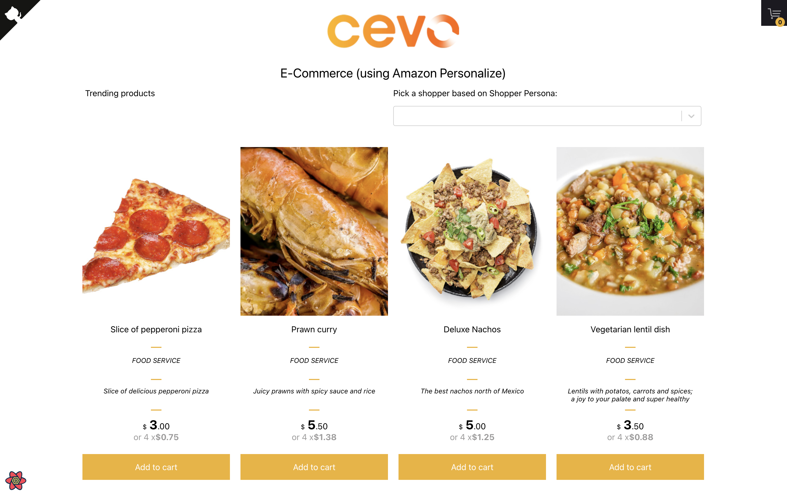
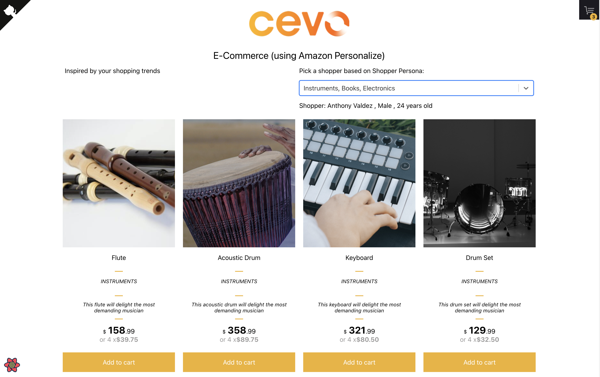
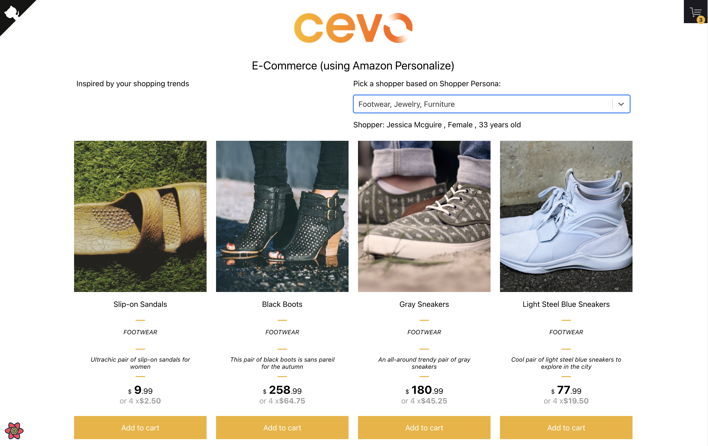

## Shopping App + Amazon Personalize

[Amazon Personalize](https://aws.amazon.com/personalize/) is a fully managed machine learning service (Recommendation Engine) that uses your data to generate item recommendations for your users. It can also generate user segments based on the users' affinity for certain items or item metadata.

Building **Recommendation Systems** is hard to do well, let Amazon do the heavy lifting for you.

For this application, we will have:

- [fictitious E-Commerce website repo](https://github.com/cevoaustralia/cevo-shopping-demo)
- with user personas, items and interactions [simulated like what was done here](https://github.com/aws-samples/retail-demo-store).

Here are a list of things we want to find out:

1. Why do we need personalization
1. How to plug in our own data to it
1. What recommender recipe to use with what type of problem
1. How to test recommendations
1. How to create recommenders from script
1. How to handle User cold starts

```javascript
/* First, Install the needed packages */
yarn install

/* Then start the React app */
yarn start

```

## Tech Stack
- AWS Amplify
- ReactJS/TypeScript
- python
- AWS Personalize
- AWS S3
- AWS Lambda
- AWS Systems Manager

## Screenshots

This application is a demo of a **fictitious E-Commerce website**. It is not a production quality application, it is for demo and education purposes only. It built inspired by [Retail Demo Store](https://github.com/aws-samples/retail-demo-store), and AWS Samples project built to demonstrate many AWS Service including [AWS Personalize](https://aws.amazon.com/personalize/). I thought of using that repo for this demo, however it had too comprehensive with so many integrations and I thought it was too complicated for my readers to understand the main purpose of this project, which was how to simply start using AWS Personalize from scratch.

The application works with a generated set of shopper personas, items and interactions. The shopper personas are used to **simulate different types of shoppers**, and the **interactions** are used to simulate how shoppers interact with the website. The items are the products that are available for sale on the website. 

As you load the site, it starts with no shopper persona selected, typical of first time visitors. This is what is being called a **Cold user**, because there will not be any historical interactions for that shopper, the system will simply display 'Trending' products. There return the most popular products on the site, but they are not personalized to any particular shopper.
<br/>
<br/>

<figure>
	<a href="./images/00-cevo-shopping-demo.png"></a>
</figure>
<br/>
<br/>

The above image shows when a cold user visits the site, and since the recommender does not have any interaction history for this shopper, it responds back with trending or popular products. 

<br/>
<br/>

<figure>
	<a href="./images/01-checkout-buy.png"></a>
</figure>
<br/>
<br/>

The above image is of the checkout screen, where it shows the items in the cart, the quantities and total price. The shopper can also change the quantity of items in the cart, and the total price will be updated accordingly. There is also a checkout button there, however don't worry you won't need a credit card (but you won't get your pizza either).

<br/>
<br/>
<figure>
	<a href="./images/02-shopping-persona.png"></a>
</figure>
<br/>
<br/>

A shopping persona can be selected, and this will simulate a shopper that has a particular type of behavior. For example, a shopper that has a `Apparel, Footwear, Accessories` persona will be more likely to buy clothing items and accessories, while a shopper that has a `Instruments, Books, Electronics` will be more likely to buy electronics and books. The shopper persona is used to simulate the type of shopper that is visiting the site, and the interactions that they will have with the site. This `shopper user id` is then passed to the AWS Personalize service, and the service will return a list of recommended products for that user.

<br/>
<br/>
<figure>
	<a href="./images/03-another-persona.png"></a>
</figure>
<br/>
<br/>

Further, as you select different shopper personas, you will see that the recommended products will change. This is because the shopping persona is used to pick a shopper interacting with the site.

<br/>
<br/>

## Why do we need personalization

**Recommendation systems** are valuable because they help users discover products, services, or content that they may not have otherwise found on their own. These systems use data analysis techniques to make predictions or suggestions based on a user's past behavior, preferences, and interests.

By providing personalized recommendations, these systems can improve user engagement and satisfaction, increase customer loyalty, and drive sales for businesses.

## How to plug in our own data to it

This demo project uses a **generated** set of **user**, **items** and **interactions**. The shopper personas are used to pick users, and the interactions are used to simulate how users interact with the website. The items are the products that are available for sale on the website. Please see this [script that generates users, items and interactions](./generators/generate_interactions_personalize.py). This was adapted from the [Retail Demo Store](https://github.com/aws-samples/retail-demo-store).

## What recommender recipe to use with what type of problem
The use case we are trying to solve is a **product recommendation** problem. We want to recommend products to users based on their past interactions with the website. The recipe we want to use for this use case is **E-Commerce**. Here are [more details](https://docs.aws.amazon.com/personalize/latest/dg/ECOMMERCE-items-dataset.html) from AWS Personalize page. 

## How to create recommenders from script

I created 2 recommenders for this demo, one for `cold start` and one for `warm start`. The `cold start` recommender (called `trending products` recommender), used when there is no historical data for the user, and the `warm start` recommender (called `recommeded for you` recommender) is used when there is historical data for the user.

The steps to create our 2 recommenders are:
- create a dataset group
- create a dataset for the users
- create a dataset for the items
- create a dataset for the interactions
- create a recommender
- test the recommender
- add the API in the lambda function
- wire it up with the frontend
<br/>
<br/>
<figure>
	<a href="./images/05-create-recommenders-inprogress.png"></a>
</figure>
<br/>
<br/>

## How to test recommendations

We've done this through boto3 SDK calls to the AWS Personalize API, like so:
```
personalizeRt = boto3.Session(
    profile_name="<aws-profile-replace-me>", region_name="ap-southeast-2"
).client("personalize-runtime")

response = personalizeRt.get_recommendations(
    recommenderArn=recommenderArn["Parameter"]["Value"],
    userId="1870",
    numResults=20,
)
```

Where `recommenderArn` is the ARN of the recommender we want to use, and `userId` is the user id of the user we want to get recommendations for. When running local development environment, you can also supply the AWS profile to use. But in a Lambda function this will not be required as we have a custom policy for that.

### Copyright and license

The MIT License (MIT). Please see License File for more information.

<sub>Adapted frontend with thanks from <a href="https://github.com/jeffersonRibeiro/react-shopping-cart">React Shopping Cart.</a></sub>

</p>
